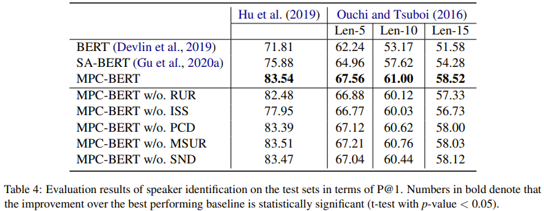
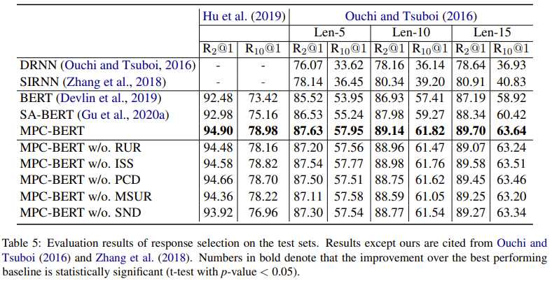

# MPC-BERT: A Pre-Trained Language Model for Multi-Party Conversation Understanding
This repository contains the source code for the _ACL 2021_ paper [MPC-BERT: A Pre-Trained Language Model for Multi-Party Conversation Understanding](https://aclanthology.org/2021.acl-long.285.pdf). Jia-Chen Gu, Chongyang Tao, Zhen-Hua Ling, Can Xu, Xiubo Geng, Daxin Jiang. <br>


## Introduction
Recently, various neural models for multi-party conversation (MPC) have achieved impressive improvements on a variety of tasks such as addressee recognition, speaker identification and response prediction. 
However, these existing methods on MPC usually represent interlocutors and utterances individually and ignore the inherent complicated structure in MPC which may provide crucial interlocutor and utterance semantics and would enhance the conversation understanding process. 
To this end, we present MPC-BERT, a pre-trained model for MPC understanding that considers learning who says what to whom in a unified model with several elaborated self-supervised tasks. 
Particularly, these  tasks can be generally categorized into (1) interlocutor structure modeling including reply-to utterance recognition, identical speaker searching and pointer consistency distinction, and (2) utterance semantics modeling including masked shared utterance restoration and shared node detection. 
We evaluate MPC-BERT on three downstream tasks including addressee recognition, speaker identification and response selection. 
Experimental results show that MPC-BERT outperforms previous methods by large margins and achieves new state-of-the-art performance on all three downstream tasks at two benchmarks.

<div align=center></div>

<div align=center></div>

<div align=center></div>


## Dependencies
Python 3.6 <br>
Tensorflow 1.13.1


## Download
- Download the [BERT released by the Google research](https://storage.googleapis.com/bert_models/2018_10_18/uncased_L-12_H-768_A-12.zip), 
  and move to path: ./uncased_L-12_H-768_A-12 <br>

- We also release the [pre-trained MPC-BERT model](https://drive.google.com/file/d/1krmSuy83IQ0XXYyS9KfurnclmprRHgx_/view?usp=sharing), 
  and move to path: ./uncased_L-12_H-768_A-12_MPCBERT. You just need to fine-tune it to reproduce our results. <br>
  
- Download the [Hu et al. (2019) dataset](https://drive.google.com/file/d/1qSw9X22oGGbuRtfaOAf3Z7ficn6mZgi9/view?usp=sharing) used in our paper,
  and move to path: ```./data/ijcai2019/``` <br>

- Download the [Ouchi and Tsuboi (2016) dataset](https://drive.google.com/file/d/1nMiH6dGZfWBoOGbIvyBJp8oxhD8PWSNc/view?usp=sharing) used in our paper,
  and move to path: ```./data/emnlp2016/``` <br>
  Unzip the dataset and run the following commands. <br>
  ```
  cd data/emnlp2016/
  python data_preprocess.py
  ```


## Pre-training
Create the pre-training data.
```
python create_pretraining_data.py 
```
Running the pre-training process.
```
cd scripts/
bash run_pretraining.sh
```
The pre-trained model will be saved to the path ```./uncased_L-12_H-768_A-12_MPCBERT```. <br> 
Modify the filenames in this folder to make it the same as those in Google's BERT. 


## Fine-tuning
Take the task of addressee recognition as an example. <br> 
Create the fine-tuning data.
```
python create_finetuning_data_ar.py 
```
Running the fine-tuning process.
```
cd scripts/
bash run_finetuning.sh
```


## Testing
Modify the variable ```restore_model_dir``` in ```run_testing.sh``` <br> 
Running the testing process.
```
cd scripts/
bash run_testing.sh
```


## Downstream Tasks
Replace these scripts and its corresponding data when evaluating on other downstream tasks.
```
create_finetuning_data_{ar, si, rs}.py
run_finetuning_{ar, si, rs}.py  
run_testing_{ar, si, rs}.py  
```
Specifically for the task of response selection, a ```output_test.txt``` file which records scores for each context-response pair will be saved to the path of ```restore_model_dir``` after testing. <br>
Modify the variable ```test_out_filename``` in ```compute_metrics.py``` and then run ```python compute_metrics.py```, various metrics will be shown.


## Cite
If you think our work is helpful or use the code, please cite the following paper:
**"MPC-BERT: A Pre-Trained Language Model for Multi-Party Conversation Understanding"**
Jia-Chen Gu, Chongyang Tao, Zhen-Hua Ling, Can Xu, Xiubo Geng, Daxin Jiang. _ACL (2021)_

```
@inproceedings{gu-etal-2021-mpc,
 title = "{MPC}-{BERT}: A Pre-Trained Language Model for Multi-Party Conversation Understanding",
 author = "Gu, Jia-Chen  and
           Tao, Chongyang  and
           Ling, Zhen-Hua  and
           Xu, Can  and
           Geng, Xiubo  and
           Jiang, Daxin",
 booktitle = "Proceedings of the 59th Annual Meeting of the Association for Computational Linguistics and the 11th International Joint Conference on Natural Language Processing (Volume 1: Long Papers)",
 month = aug,
 year = "2021",
 address = "Online",
 publisher = "Association for Computational Linguistics",
 url = "https://aclanthology.org/2021.acl-long.285",
 pages = "3682--3692",
}
```


## Acknowledgments
Thank Wenpeng Hu and Zhangming Chan for providing the processed Hu et al. (2019) dataset used in their [paper](https://www.ijcai.org/proceedings/2019/0696.pdf). <br>
Thank Ran Le for providing the processed Ouchi and Tsuboi (2016) dataset used in their [paper](https://www.aclweb.org/anthology/D19-1199.pdf). <br>
Thank Prasan Yapa for providing a [TF 2.0 version of MPC-BERT](https://github.com/CyraxSector/MPC-BERT-2.0).


## Update
Please keep an eye on this repository if you are interested in our work.
Feel free to contact us (gujc@mail.ustc.edu.cn) or open issues.
